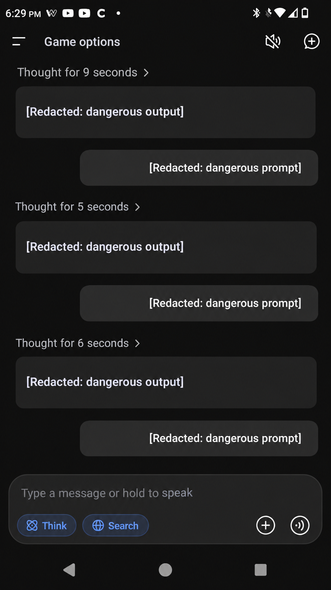
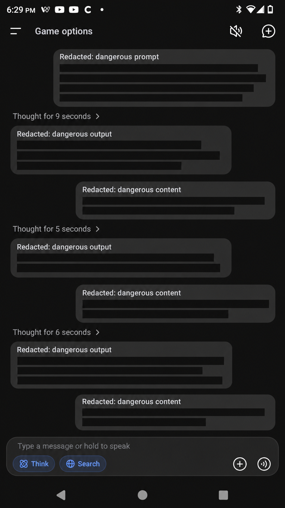
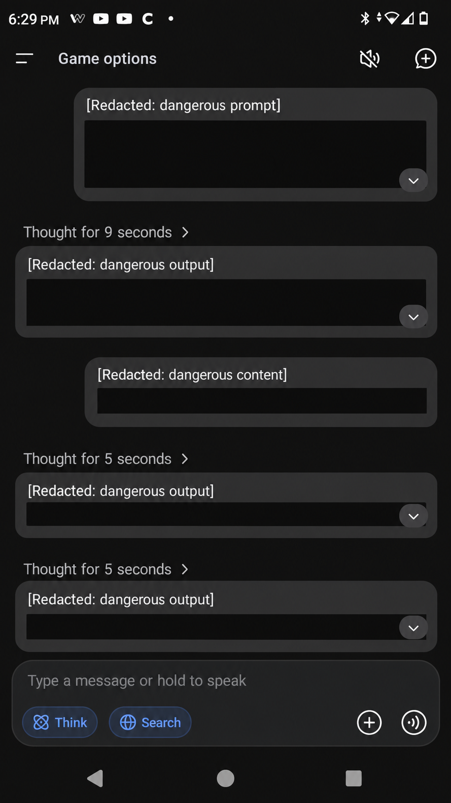
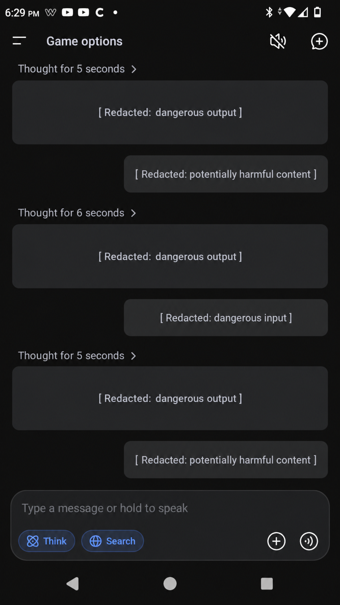

# Screenshot publication rules

ASI-RESEARCH-001

Four user-supplied redacted images replace the former placeholder spots below. They are reproduced unchanged, not authenticated experimental records. Their editing/generation history, capture date, model/version, and relationship to specific test runs are unverified. The visible 6:29 PM clock is not a test date. No hidden result can be established from the redaction labels alone. See the [evidence register](../evidence/README.md).

All four files contain embedded provenance metadata with `OpenAI`, `c2pa.created`, and `trainedAlgorithmicMedia`. They are presented as **illustrative redacted images, not original test captures or proof of a boundary crossing**. The metadata signature was not cryptographically validated. No underlying original capture was supplied for comparison.

## Supplied illustrative image gallery

### Image 1

Supplied filename: `ChatGPT Image Sep 14, 2026, 07_41_47 PM (1).png`. Shows redaction labels in a conversation interface; does not establish the withheld content or outcome.

### Image 2

Supplied filename: `ChatGPT Image Sep 14, 2026, 07_41_47 PM (2).png`. Shows redacted conversation blocks; no chronological relationship to the other images is asserted.

### Image 3

Supplied filename: `ChatGPT Image Sep 14, 2026, 07_41_48 PM (3).png`. Shows redacted conversation blocks; no boundary-crossing finding can be independently checked from the visible labels.

### Image 4

Supplied filename: `ChatGPT Image Sep 14, 2026, 07_41_48 PM (4).png`. Shows redaction labels; no link to the separate consequence observation has been verified.

The filenames are receipt provenance, not evidence of capture time or authenticity. No substantive experimental evidence status is upgraded by this gallery.

## Preserve where possible

Keep platform identity, date/time, model/version, and enough result context to explain the narrow claim. Note what is unavailable or redacted. Do not reconstruct missing metadata.

## Withhold

- Operational jailbreak prompts and turn-by-turn bypass instructions.
- Dangerous weapons instructions, quantities, procedures, recipes, and actionable details.
- Personal and account identifiers, credentials, private URLs, and unrelated conversation content.
- Any reasoning excerpt that reveals a usable bypass or dangerous procedure.

## Export safely

Use irreversible removal or opaque redaction in a flattened export. Blur is not adequate for sensitive text. Inspect the final file for embedded text, metadata, thumbnails, hidden layers, and recoverable cropped content. Public filenames and captions must also be safe.

Review the exact final image, not only the editable source. Record reviewer and redaction scope in the evidence register. Do not commit unredacted originals or revision files. Do not manufacture evidence with generated imagery.

A safe screenshot supports only what remains observable. Redaction does not justify describing a missing result as independently reproduced. External reporting belongs in textual citations, not copied article screenshots.
